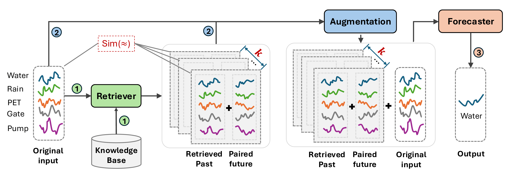
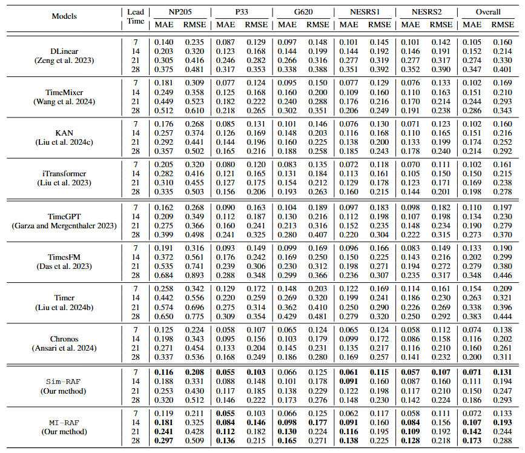

# WaterRAF
Retrieval-Augmented Water Level Forecasting for Everglades

Here's an overview of our Retrieval-Augmented Forecasting (RAF) framework for water level forecasting. 


## Installation

1. Create & activate your Python environment:
    - `conda create -n ENV_NAME python=3.10`
    - `conda activate ENV_NAME`

2. Install dependencies:
    - `pip install -r requirements.txt`

3. Verify your setup:
    - `python --version`  # should show Python 3.10.x
    - `pip list`          # confirm key packages are installed
   
## Directory Tree
```text
WaterRAF/                       - this repository root
├── README.md                   
├── requirements.txt            - pinned Python dependencies
├── Data/                       - raw & processed time-series data
│   └── final_2025_data.csv
├── ChronosBolt/                - adapter + exploration notebooks
│   ├── chronos_bolt_adapter.py
│   ├── Strategy-A-ChronosBolt.ipynb
│   ├── Strategy-B-ChronosBolt.ipynb
│   └── Strategy-C-ChronosBolt.ipynb
├── Visualizations/             - analysis & plotting notebooks
│   ├── Everglades-CorrelationPlots-Station-Variables-Analysis.ipynb
│   ├── RetDatabaseStudy-Heatmap.ipynb
│   ├── Visualization-Figure5-7days.ipynb
│   ├── Visualization-Figure5-14days.ipynb
│   ├── Visualization-Figure5-21days.ipynb
│   └── Visualization-Figure5-28days.ipynb
│
├── Web Demo Application/      # Web Application demo folder
│   └── app.py                 # Streamlit application for RAF demo
│
└── figure/                    - static framework image for README
    └── framework.png
```

## Usage

- Run the models by executing the three exploration notebooks under the `ChronosBolt/` folder:
  1. `Strategy-A-ChronosBolt.ipynb`  
     _“Averaging-First, Augmenting-Later”_  
     Retrieves windows, computes the pointwise average over the retrieved windows, averaged context is concatenated with the original input, then forecasts
  2. `Strategy-B-ChronosBolt.ipynb`  
     _“Augmenting-First, Averaging-Later”_  
     Retrieves windows, concatenates each retrieved window with original input separately, runs Chronos on each, then averages the forecasts.
  3. `Strategy-C-ChronosBolt.ipynb`  
     _“Long-Context Concatenation”_  
     Concatenates all retrieved windows and original context into one long input, then forecasts 

- **Key configuration variables** (top of each notebook):
  - `input`: number of past days fed to the model (default: 100)  
  - `prediction_length`: forecast horizon in days (e.g. 7, 14, 21, 28)  
  - `top_n`: number of retrieval windows to use  
    - `0` → pure Chronos baseline (no retrieval)  
    - `>0` → retrieval-augmented forecasting  

- **Running the Web Demo Application**
   The web interface allows interactive 7-days forecasting with:
   - Similarity-based RAF (SimRAF)
   - Mutual-Information-based RAF (MIRAF)
   - Full retrieval visualization
   - Baseline vs RAF comparison
   - Plots for historical context + forecast + actual truth

- **Run the Application**
  - `cd WebDemo`
  - `streamlit run app.py`

- **The app allows users to:**
  - Select a station
  - Choose SIM-RAF or MI-RAF
  - Pick a cutoff date
  - Visualize


## Results
Here's a table displaying the performance of the models across 5 stations (NP205, P33, G620, NESRS1, NESRS2) for lead times of 7, 14, 21, and 28 days. The
first four baseline models are task-specific, followed by four pre-trained time series foundation models. The last two are our RAF methods with similarity-based and mutual information-based implementations. The best results are in bold. 
<p align="center">
  
</p>
