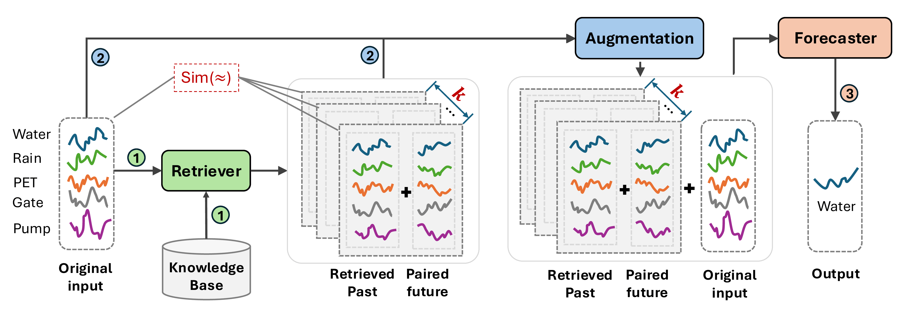

# WaterRAF
Retrieval-Augmented Water Level Forecasting for Everglades

Here's an overview of our Retrieval-Augmented Forecasting (RAF) framework for water level forecasting. 

## Installation

1. Create & activate your Python environment
   conda create -n ENV_NAME python=3.10
   conda activate ENV_NAME

2. 
   
